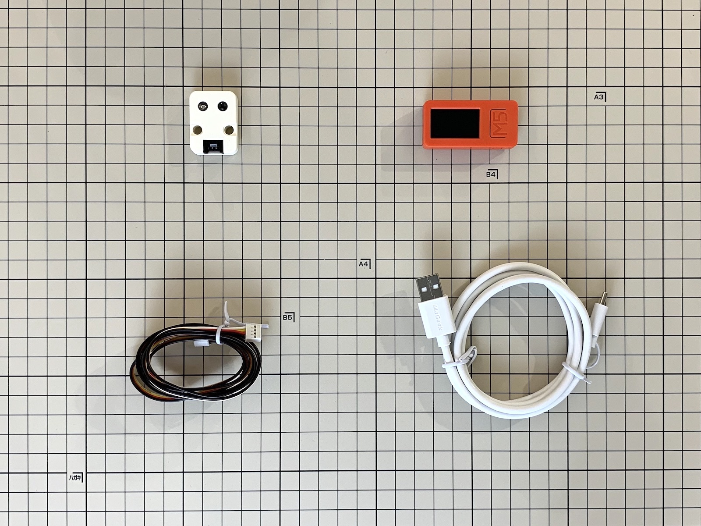
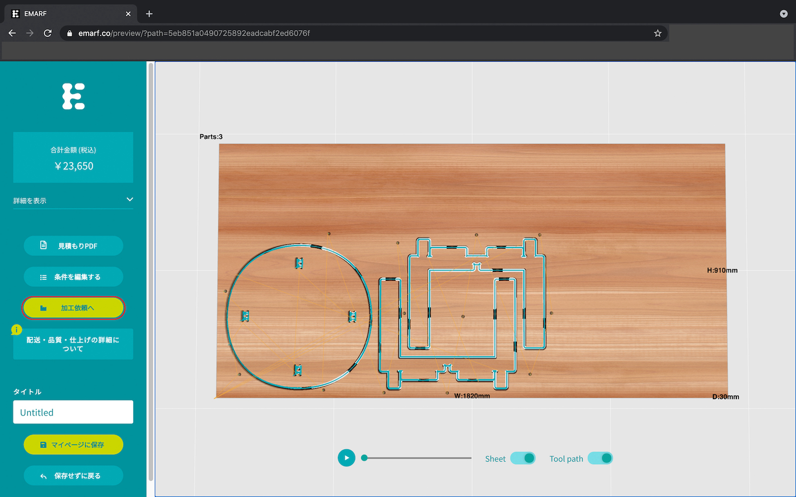

## 【D+IO Product #6】Hackable Furnitureの作り方 
### 〜 家具に機能をアドオンする D+IO Product 〜

**ソースコードはこちらです**
 [https://github.com/panasonic-corporation/doingio-hackable-furniture/blob/master/HackableFurniture/HackableFurniture.ino](https://github.com/panasonic-corporation/doingio-hackable-furniture/blob/master/HackableFurniture/HackableFurniture.ino)

### プロダクト概要

家具に機能をアドオンするD+IO Product「Hackable Furniture」。

最近ではWi-Fiルーターやスマートスピーカーなど便利なガジェットや周辺機器を生活空間に導入する人が増えています。

そのようなもののおかげで便利な暮らしになっている一方、部屋がモノで散らかって見えてしまうのも事実のようです。

もし、テーブルやソファなど生活に必要不可欠な家具に、便利な機能を持った家電やガジェットなどが埋め込まれていたら、部屋の中が少しはスッキリすると思いませんか？

Hackable Furnitureは、家具にガジェットを組み込むことで様々な機能を家具に付与することができるデバイスです。

日々の暮らしをスッキリと、豊かにしてくれるかもしれません。

今回は天板をノックするときのパターンで家電を制御できるスマートスツールの作り方を紹介します。

スツールは今お使いのスツールを使用することもできますし、木材加工サービス[EMARF](https://emarf.co)を使用することでD+IO専用のスツールを特注することもできます。

D+IO専用スツールは様々なM5Stack製ガジェットを接続できるように設計されており、ユースケースに合わせて機能をカスタマイズすることで目的にあったスマートなスツールを製作することができます。 （別途3Dプリンターで出力したパーツが必要です。）

 

##  D+IO Project

**パナソニック株式会社/FUTURE LIFE FACTORY**

[D+IO プロジェクト詳細](https://panasonic.co.jp/design/flf/works/doing_io/)

 

## 作り方
  
### 1 準備

- 必要なパーツ、材料

    

|     | 部品名     | 個数 |  販売リンク（例）  | 備考 |
|:----:|:---------|:----|:------------------------|:----|
|  1  | M5StickC Plus | 1 |[スイッチサイエンス](https://www.switch-science.com/catalog/6470/) | |
|  2  | USB Type-Cケーブル | 1 | [スイッチサイエンス](https://www.switch-science.com/catalog/3792/) | 給電用。必要に応じて長いケーブルを購入してください。 |
|  3  | M5Stack用赤外線送受信ユニット | 1 |[スイッチサイエンス](https://www.switch-science.com/catalog/5699/) | 一般的な赤外線受信センサを使ってもOKです |
|  4  | HY2.0 ケーブル (Groveケーブル) | 1 | [スイッチサイエンス](https://www.switch-science.com/catalog/5216/) | M5Stack用赤外線送受信ユニットに付属していますが、必要に応じて長いケーブルを購入してください |

★ 参考価格（総額） : 約4,000円

- D+IO専用スツールを制作する場合

    

|     | 部品名     | 個数 |  販売リンク（例）  | 備考 |
|:----:|:---------|:----|:------------------------|:----|
|  1  | 木材パーツ | 1 |  | D+IO専用スツールを製作する場合必要。注文方法は後述。 |
|  2  | 3Dプリントパーツ | 1 |  | D+IO専用スツールを製作する場合必要。 |
|  3  | レゴ テクニック ピン | 4 | [Amazon](https://www.amazon.co.jp/dp/B07KDW6T5F) | D+IO専用スツールを製作する場合必要。|
|  4  | M5StickC用マウンタ | 1 | [スイッチサイエンス](https://www.switch-science.com/catalog/5517/) | D+IO専用スツールを製作する場合必要。M5StickCを購入するとついてくるレゴ互換マウンタを使用します。|

### 2 開発環境のダウンロードとインストール

下記リンクを参考に開発環境をインストールしてください。

[M5Stack開発環境のダウンロードとインストール](https://github.com/panasonic-corporation/doingio-base-docs/blob/master/README.md#a-m5stack%E9%96%8B%E7%99%BA%E7%92%B0%E5%A2%83%E3%81%AE%E3%83%80%E3%82%A6%E3%83%B3%E3%83%AD%E3%83%BC%E3%83%89%E3%81%A8%E3%82%A4%E3%83%B3%E3%82%B9%E3%83%88%E3%83%BC%E3%83%AB)

### 3 ファームウェアのダウンロード

1. ファームウェアをダウンロードしてください。

    このページ上部の「Code」ボタンからダウンロードできます

    

1. プロジェクトを開いてください。

    ダウンロードしたフォルダを開き、doingio-hackable-furniture/HackableFurniture/HackableFurniture.ino をダブルクリックしてArduino IDEでファイルを開きます。

### 4 ライブラリのダウンロードとインストール

1. ”スケッチ” → ”ライブラリをインクルード” → ”ライブラリを管理”「IRremoteESP」と検索して「IRremoteESP8266」をインストールしてください  

    

### 5 Config.h の設定

1. Arduino IDEの上のタブからConfig.hを選択します。

1. Arduino IDEでconfig.hを開き、**必要であれば**下記項目を修正します。
    - KNOCK_LIMIT: ノックの回数
    - TIME_OUT: タイムアウト時間 ms
    - LONG_THRE: 長いノックを判定するしきい値 ms
    - KNOCK_DELAY: チャタリング防止Delay ms
    - ACC_THRE_BIAS: ノック感度の調整
    - tv_addr: テレビ用赤外線信号のアドレス
    - data_tv_power: テレビ電源信号のコマンド
    - data_tv_ch_up: TVチャンネル+信号のコマンド
    - data_tv_ch_down: TVチャンネル-信号のコマンド
    - data_tv_vol_up: TVボリューム+信号のコマンド
    - data_tv_vol_down: TVボリューム-信号のコマンド

### 6 書き込み

1. PCとM5StickC PlusをUSBケーブルで接続し、Arduino IDEの「ツール」タブを開き下記の通り設定します。

    

1. 「書き込み」アイコンをクリックしてArduinoにファームウェアを書き込みます。

    

### 7 配線 / 組み立て

1. M5StickC Plus に GroveケーブルとUSBケーブルを接続します。

    

1. 赤外線送受信ユニット に Groveケーブルを接続します。

    

1. USBケーブルを電源に接続します。

1. お使いのテーブルに両面テープなどで貼り付けてください。（D+IO専用スツールを製作する場合は次のステップへ）

### 8 D+IO専用スツールの作り方（お手持ちのテーブルなどに取り付ける場合はスキップ）

1. [EMARF](https://emarf.co/)にアクセスしてください。

1. doingio-hackable-furniture/data/dio_stool.dxfのファイルをアップロードしてください。

    

1. 厚さ30mmの板を選択してください。

    

1. 材料を選択し、仕上げを選んでください。バリ取りがおすすめです。（材料のリストはここで確認できます）

    

1. 金額とレイアウトを確認し、「加工データを生成」をクリックしてください。

    

1. 注文が完了したらEMARFからメールが送られてきます。

    

### 9 D+IO専用スツールの組み立て方（お手持ちのテーブルなどに取り付ける場合はスキップ）

1. doingio-hackable-furniture/data/dio_stool_parts.stepのファイルを3Dプリンターで出力してください。

    

1. EMARFから届いた木材パーツと3Dプリンターで出力したパーツを以下の画像のとおり組み立ててください。

    

1. 3Dパーツの片方にレゴ テクニック ピンパーツ2個を使用してM5StickC Plusを固定してください。

    

1. 3Dパーツのもう片方にレゴ テクニック ピンパーツ2個を使用して赤外線モジュールを固定してください。

    

1. 完成です

### 10 使用方法

1. USBケーブルを電源に差すと起動します。

1. 起動してから最初の2秒間は加速度センサーのキャリブレーションを行います。デバイスを取り付けたテーブルやスツールに振動を与えないようにしてください。

1. 天板をノックするパターンによってパナソニック製のテレビとエアコンをコントロールすることができます。
ノックのパターンとコントロールできる種類は以下のとおりです。

|パターン| コントロール |
|:----|:--------|
| . . . . （ト・ト・ト・ト）| テレビ 電源 |
| . . _ . （ト・ト・トン・ト）| テレビ チャンネル + |
| . _ . . （ト・トン・ト・ト）| テレビ チャンネル - |
| . _ _ . （ト・トン・トン・ト）| テレビ ボリューム +|
| _ . . . （トン・ト・ト・ト）| テレビ ボリューム -|
| _ . _ . （トン・ト・トン・ト）| エアコン 冷房 |
| _ _ . . （トン・トン・ト・ト）| エアコン 暖房|
| _ _ _ . （トン・トン・トン・ト）| エアコン 停止|

プログラムを変更することで様々な家電を操作できるので試してみましょう！

   

## ライブラリ及びライセンス
| ライブラリ名| 配布元 | コピーライトまたは貢献者 | ライセンス |
|:---|:----|:----|:----|
| IRRemoteESP8266 | [URL](https://github.com/crankyoldgit/IRremoteESP8266) | Copyright (C) 1991, 1999 Free Software Foundation, Inc. | [LICENSE](https://github.com/crankyoldgit/IRremoteESP8266/blob/master/LICENSE.txt) |
